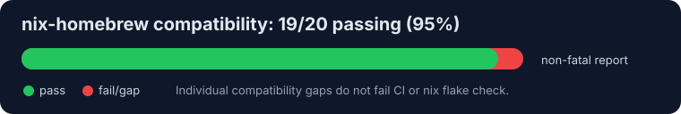

# nix-zerobrew

Declarative [Zerobrew](https://github.com/lucasgelfond/zerobrew) management for macOS via [nix-darwin](https://github.com/LnL7/nix-darwin).

[Zerobrew](https://github.com/lucasgelfond/zerobrew) is a 5-20x faster experimental Homebrew alternative written in Rust. It brings uv-style architecture to Homebrew packages -- using content-addressable storage, APFS clonefiles, and Homebrew's existing formula ecosystem.

`nix-zerobrew` pins the Zerobrew binary through Nix and manages activation-time lifecycle concerns: directory setup, migration safeguards, ownership, launchers, Rosetta routing, and shell integration. It manages the package manager itself, not the packages you install with it.

## Highlights

- Declarative Zerobrew installation via nix-darwin
- Builds Zerobrew from source with a pinned Rust toolchain
- Prefix lifecycle management with migration safeguards
- Multi-prefix support with sensible defaults
- Optional Rosetta prefix for Intel binaries on Apple Silicon
- Architecture-aware `zb` and `zbx` launchers that dispatch to the correct prefix
- Shell integration for bash, zsh, and fish
- Optional declarative tap management with mutable or fully Nix-managed taps
- Lifecycle support for Zerobrew casks, external tap formula refs, bundle, doctor, upgrade, outdated, and gc
- Declarative brews, casks, and Mac App Store apps at top level for the host default prefix or per-prefix



This graph is generated by the non-fatal compatibility report suite. Failed checks are compatibility gaps and do not mean the repository is broken. Regenerate or inspect the report with:

```bash
nix build .#nix-homebrew-compatibility-report
```

## Installation

Add `nix-zerobrew` to your flake inputs:

```nix
{
  inputs = {
    nixpkgs.url = "github:NixOS/nixpkgs/nixpkgs-unstable";
    nix-darwin.url = "github:LnL7/nix-darwin";
    nix-darwin.inputs.nixpkgs.follows = "nixpkgs";

    nix-zerobrew.url = "github:JudahZF/nix-zerobrew";
    nix-zerobrew.inputs.nixpkgs.follows = "nixpkgs";

    # Optional: Declarative tap management
    homebrew-core = {
      url = "github:homebrew/homebrew-core";
      flake = false;
    };
  };
}
```

Then import the module in your nix-darwin configuration:

```nix
{
  modules = [
    nix-zerobrew.darwinModules.default
  ];
}
```

## Quick Start

### New Installation

```nix
{
  nix-zerobrew = {
    enable = true;
    user = "yourusername";
  };
}
```

### Existing Zerobrew Installation

If you already have Zerobrew installed outside of Nix, set `autoMigrate` to allow nix-zerobrew to take ownership of the existing directories:

```nix
{
  nix-zerobrew = {
    enable = true;
    user = "yourusername";
    autoMigrate = true;
  };
}
```

Without `autoMigrate`, nix-zerobrew will error if it finds an existing installation that it doesn't manage (indicated by the absence of a `.managed_by_nix_darwin` marker file).
This is typically a one-time migration toggle rather than something you need for normal day-to-day use after nix-zerobrew has taken ownership.

Managed installs created by older `nix-zerobrew` releases used a legacy `${root}/prefix` link tree. When you upgrade to the current module, nix-zerobrew automatically migrates that managed layout to the upstream-compatible root-as-prefix layout.
If both the old legacy link tree and the new root-level link tree are present, nix-zerobrew now performs best-effort cleanup: it migrates any missing root-level entries, warns about overlapping paths, and continues activation without attempting an automatic merge.

## Rosetta (Apple Silicon)

On Apple Silicon Macs, you can set up a second Intel-architecture prefix under Rosetta 2:

```nix
{
  nix-zerobrew = {
    enable = true;
    user = "yourusername";
    enableRosetta = true;
  };
}
```

This creates both an ARM64 prefix (`/opt/zerobrew`) and an Intel prefix (`/usr/local/zerobrew`). The unified `zb` launcher detects the current architecture at runtime, so `arch -x86_64 zb install ...` will target the Intel prefix automatically.

Rosetta 2 must be installed on the system. nix-zerobrew will print a warning during activation if it is not detected.

## Configuration Options

| Option | Type | Default | Description |
|---|---|---|---|
| `enable` | `bool` | `false` | Enable Zerobrew management |
| `enableRosetta` | `bool` | `false` | Set up Intel prefix for Rosetta on Apple Silicon |
| `package` | `package` | flake default | Native Zerobrew package |
| `packageRosetta` | `null or package` | x86_64 package | Zerobrew package for Intel launchers on Apple Silicon |
| `user` | `string` | required | Owner of managed directories |
| `group` | `string` | `"admin"` | Group owner of managed directories |
| `autoMigrate` | `bool` | `false` | Allow taking over existing non-managed installations |
| `taps` | `attrsOf package` | `{}` | Nix-managed taps applied to the default prefixes |
| `mutableTaps` | `bool` | `true` | Allow imperative taps alongside Nix-managed taps |
| `enableDoctorCheck` | `bool` | `true` | Run `zb doctor` for each enabled prefix during activation |
| `enableDoctorRepair` | `bool` | `false` | Run `zb doctor --repair` instead of `zb doctor` during activation |
| `enableGc` | `bool` | `false` | Run `zb gc` for each enabled prefix after doctor succeeds |
| `onActivation.autoUpdate` | `bool` | `false` | Run `zb update` during activation after prefix, tap, and launcher setup |
| `onActivation.upgrade` | `bool` | `false` | Run `zb upgrade` during activation after declarative install and cleanup |
| `onActivation.cleanup` | `"none"`, `"uninstall"`, or `"zap"` | `"uninstall"` | Cleanup mode for previously tracked packages that are no longer declared; `"zap"` is currently rejected as unsupported |
| `onActivation.gc` | `bool` | `false` | Run `zb gc`; effective when this or legacy `enableGc` is true |
| `onActivation.doctor` | `"none"`, `"check"`, or `"repair"` | `"check"` | Doctor action during activation; legacy `enableDoctorCheck` and `enableDoctorRepair` remain supported |
| `warnAboutPackageManagement` | `bool` | `true` | Emit an activation note about declarative package scope |
| `brews` | `listOf (string or { name, args })` | `[]` | Formula names, fully qualified Zerobrew formula refs, or Brewfile-shaped entries to install declaratively in the host default prefix |
| `casks` | `listOf (string or { name, args })` | `[]` | Cask tokens or Brewfile-shaped entries to install declaratively in the host default prefix, without the `cask:` prefix |
| `masApps` | `attrsOf positive int` | `{}` | Mac App Store apps to install declaratively in the host default prefix; names are labels and values are app IDs |
| `extraEnv` | `attrsOf string` | `{}` | Additional environment variables injected into launchers |
| `prefixes` | `attrsOf submodule` | auto | Prefix configuration map (see below) |
| `enableBashIntegration` | `bool` | `true` | Add Zerobrew bin directory to PATH in bash |
| `enableZshIntegration` | `bool` | `true` | Add Zerobrew bin directory to PATH in zsh |
| `enableFishIntegration` | `bool` | `true` | Add Zerobrew bin directory to PATH in fish |

### Prefixes

Each prefix represents a Zerobrew installation root. nix-zerobrew creates the following layout under each prefix:

- `${prefix}/store` -- content-addressable package storage
- `${prefix}/db` -- package database
- `${prefix}/cache` -- download cache
- `${prefix}/locks` -- lock files
- `${prefix}/bin`, `${prefix}/sbin`, `${prefix}/Cellar`, `${prefix}/Caskroom`, `${prefix}/opt`, `${prefix}/lib`, `${prefix}/include`, `${prefix}/share`, `${prefix}/etc`, `${prefix}/var`, `${prefix}/Frameworks`, `${prefix}/Library/Taps` -- default user-facing link directory

This matches upstream Zerobrew's current macOS layout and pre-creates Homebrew-style locations used by casks and source builds. If you need a non-standard link location, you can still override `prefixes.<name>.linkDir` explicitly. If an upstream feature needs additional prefix directories later, add them with `prefixes.<name>.extraLinkDirs`.

#### `prefixes.<name>` options

| Option | Type | Default | Description |
|---|---|---|---|
| `enable` | `bool` | varies by architecture | Whether this prefix is active |
| `prefix` | `string` | attribute key | Zerobrew root directory |
| `linkDir` | `string` | `${prefix}` | User-facing link directory |
| `package` | `null or package` | `null` (falls back to `nix-zerobrew.package`) | Override the Zerobrew package for this prefix |
| `taps` | `attrsOf package` | `{}` (default prefixes inherit `nix-zerobrew.taps`) | Nix-managed taps for this prefix |
| `brews` | `listOf (string or { name, args })` | `[]` | Formula names, fully qualified Zerobrew formula refs, or Brewfile-shaped entries to install declaratively in this prefix |
| `casks` | `listOf (string or { name, args })` | `[]` | Cask tokens or Brewfile-shaped entries to install declaratively in this prefix, without the `cask:` prefix |
| `masApps` | `attrsOf positive int` | `{}` | Mac App Store apps to install declaratively in this prefix; names are labels and values are app IDs |
| `extraLinkDirs` | `listOf string` | `[]` | Additional directories to create under `linkDir` |

By default on Apple Silicon, the ARM64 prefix (`/opt/zerobrew`) is enabled and the Intel prefix (`/usr/local/zerobrew`) is disabled unless `enableRosetta` is set. On Intel Macs, only the Intel prefix is enabled.

On macOS, path-sensitive packages may fail if the effective `linkDir` exceeds 13 characters. nix-zerobrew warns during activation when this happens, but still allows explicit long paths for advanced setups.

### Advanced Prefix Example

```nix
{
  nix-zerobrew = {
    enable = true;
    user = "alice";

    prefixes = {
      "/opt/zerobrew" = {
        enable = true;
      };

      "/Volumes/FastSSD/zerobrew" = {
        enable = true;
        linkDir = "/Volumes/FastSSD/zerobrew/prefix";
      };
    };
  };
}
```

### Declarative Taps

Zerobrew can install fully-qualified external tap formula references, and nix-zerobrew can expose pinned tap repositories under each managed prefix:

```nix
{
  nix-zerobrew = {
    enable = true;
    user = "alice";

    taps = {
      "homebrew/homebrew-core" = homebrew-core;
      "hashicorp/homebrew-tap" = hashicorp-tap;
    };

    mutableTaps = false;
  };
}
```

Tap keys map directly to `${prefix}/Library/Taps/<key>`. Use the actual repository folder name; GitHub tap repositories usually include the `homebrew-` prefix, such as `homebrew/homebrew-core` or `hashicorp/homebrew-tap`.

With `mutableTaps = true`, declared taps are linked into `Library/Taps` and imperative tap changes can coexist. With `mutableTaps = false`, `Library/Taps` is replaced by a generated Nix store tree, so removing a tap from the Nix configuration removes it from the managed tap tree at the next activation.

If you also use nix-darwin's `homebrew.*` options, keep `homebrew.taps` aligned separately when needed, following the same pattern documented by nix-homebrew.

## Usage

After activation, the `zb` command is available system-wide:

```bash
zb --help                       # show help
zb install jq ripgrep           # install packages
zb install cask:iterm2          # install a cask
zb install lucasgelfond/zerobrew/zerobrew # install a fully-qualified tap formula
zb update                       # refresh zerobrew metadata
zb outdated                     # show outdated packages
zb outdated --json              # machine-readable outdated output
zb doctor                       # check installation health
zb doctor --repair              # repair detected installation issues
zb upgrade                      # upgrade outdated packages
zb upgrade jq wget              # upgrade selected packages
zb upgrade --build-from-source jq # build an upgrade from source
zb uninstall jq                 # uninstall a package
zb bundle                       # install from Brewfile
zb bundle install -f myfile     # install from a custom file
zb bundle dump                  # export installed packages to Brewfile
zb bundle dump -f out --force   # dump to a custom file (overwrite)
zb gc                           # garbage collect unused store entries
zb reset                        # uninstall everything
zbx jq --version                # run a package without linking it
```

Both `zb` and `zbx` are installed system-wide. On Apple Silicon with Rosetta enabled, use `arch -x86_64 zb ...` or `arch -x86_64 zbx ...` to target the Intel prefix.

Zerobrew supports casks, fully-qualified external tap formula references, Brewfile bundle workflows, outdated checks, upgrades, doctor, and garbage collection. nix-zerobrew makes those commands work cleanly by managing the prefix lifecycle, launchers, environment, health checks, and optional declarative package activation.

### Activation lifecycle

`nix-zerobrew.onActivation` provides a nix-darwin/Homebrew-style compatibility layer for package lifecycle actions during activation. By default it preserves existing nix-zerobrew behavior: no automatic `zb update`, no automatic `zb upgrade`, tracked cleanup/uninstall enabled, doctor check enabled, and garbage collection disabled unless either `enableGc` or `onActivation.gc` is enabled.

For each enabled prefix, activation runs in this order: prefix/layout/tap/launcher setup, optional `zb update`, declarative brews/casks/MAS install, optional tracked cleanup, optional `zb upgrade`, doctor check or repair, then optional `zb gc`.

`onActivation.cleanup = "uninstall"` only removes brews and casks that were previously tracked in `${ZEROBREW_ROOT}/db/nix-zerobrew/state` and are no longer declared. Manually installed packages are untouched. MAS removals are not performed; removed MAS app IDs are dropped from nix-zerobrew state only. `onActivation.cleanup = "none"` still updates nix-zerobrew state to the current declaration without uninstalling old tracked packages. `onActivation.cleanup = "zap"` is currently unsupported and rejected until Zerobrew exposes verified safe zap support.

### Declarative Packages

You can declare brews, casks, and Mac App Store apps. Simple strings remain supported; attrset entries support `name` plus Brewfile `args` emitted as `args: [...]`:

```nix
{
  nix-zerobrew = {
    enable = true;
    user = "alice";

    brews = [ "jq" { name = "ripgrep"; args = [ "HEAD" ]; } ];
    casks = [ "iterm2" { name = "visual-studio-code"; args = [ "no_quarantine" ]; } ];
    masApps = {
      Xcode = 497799835;
    };
  };
}
```

During activation, nix-zerobrew writes `${ZEROBREW_ROOT}/db/nix-zerobrew/Brewfile` for each prefix with declarations and installs declared brews and casks with `zb bundle install --file`. If `masApps` is non-empty for that prefix, it first installs the `mas` formula through Zerobrew, then runs `mas install <id>` for app IDs not already present in `mas list`.

Top-level `nix-zerobrew.brews`, `casks`, and `masApps` target the host default prefix (`/opt/zerobrew` on Apple Silicon, `/usr/local/zerobrew` on Intel). Per-prefix declarations under `nix-zerobrew.prefixes.<name>` target that specific prefix. If you declare packages both top-level and under the host default prefix, nix-zerobrew merges them with top-level entries first, then per-prefix entries. Duplicate brews/casks are removed after merging; duplicate MAS app IDs are removed with top-level IDs preferred for the host default prefix.

For example, install Rosetta-only packages into the Intel prefix on Apple Silicon:

```nix
{
  nix-zerobrew = {
    enableRosetta = true;
    prefixes."/usr/local/zerobrew".brews = [ "pkg-config" ];
  };
}
```

Package reconciliation is intentionally scoped per prefix. nix-zerobrew removes brews and casks only when `onActivation.cleanup = "uninstall"`, they were previously present in that prefix's `${ZEROBREW_ROOT}/db/nix-zerobrew/state`, and they are later removed from your Nix config. Packages you installed manually with `zb install` are not removed. MAS app removals are not attempted because `mas` does not provide a safe uninstall command; removed IDs are simply dropped from nix-zerobrew's tracking state.

Activation does not run `zb upgrade` by default; set `onActivation.upgrade = true` to opt in.

### `extraEnv` example

```nix
{
  nix-zerobrew.extraEnv = {
    ZEROBREW_API_URL = "https://zerobrew.internal.example/api";
  };
}
```

## Build and Verify

```bash
nix flake check --all-systems
nix build .#zerobrew
./result/bin/zb --help
```

## Migrating from nix-darwin `homebrew.*`

nix-zerobrew intentionally supports a Homebrew-shaped subset, but it is not full nix-darwin Homebrew parity. Zerobrew prefixes are separate from Homebrew prefixes, so if you use both modules, keep `homebrew.taps` aligned separately for nix-darwin Homebrew and `nix-zerobrew.taps`/`prefixes.*.taps` for Zerobrew.

Basic mapping:

| nix-darwin Homebrew | nix-zerobrew | Status |
|---|---|---|
| `homebrew.enable` | `nix-zerobrew.enable` | Supported |
| `homebrew.brews = [ "jq" ];` | `nix-zerobrew.brews = [ "jq" ];` | Supported for host default prefix |
| `homebrew.casks = [ "iterm2" ];` | `nix-zerobrew.casks = [ "iterm2" ];` | Supported for host default prefix |
| `homebrew.masApps` | `nix-zerobrew.masApps` | Supported for install; MAS uninstall is not attempted |
| `homebrew.onActivation.autoUpdate` | `nix-zerobrew.onActivation.autoUpdate` | Supported, emits `zb update` |
| `homebrew.onActivation.upgrade` | `nix-zerobrew.onActivation.upgrade` | Supported, emits `zb upgrade` |
| `homebrew.onActivation.cleanup = "none"/"uninstall"` | same | Supported for tracked brews/casks only |
| `homebrew.onActivation.cleanup = "zap"` | same | Unsupported; rejected at evaluation |
| `homebrew.taps` | `nix-zerobrew.taps` or `prefixes.<prefix>.taps` | Partially supported as Nix-managed tap source packages |
| rich brew/cask `name` + `args` | same shape | Supported in generated Brewfiles |
| other rich fields such as service/restart metadata, greedy, conflicts, extra Homebrew-specific flags | no equivalent | Unsupported/no-op; do not rely on them |

Simple migration:

```nix
{
  nix-zerobrew = {
    enable = true;
    user = "alice";
    brews = [ "jq" "ripgrep" ];
    casks = [ "iterm2" ];
    masApps.Xcode = 497799835;
  };
}
```

Rich Brewfile-style options:

```nix
{
  nix-zerobrew = {
    brews = [ { name = "ripgrep"; args = [ "HEAD" ]; } ];
    casks = [ { name = "visual-studio-code"; args = [ "no_quarantine" ]; } ];
  };
}
```

Per-prefix/Rosetta declarations:

```nix
{
  nix-zerobrew = {
    enable = true;
    enableRosetta = true;
    brews = [ "jq" ]; # host default prefix only
    prefixes."/usr/local/zerobrew".brews = [ "pkg-config" ];
  };
}
```

Activation actions:

```nix
{
  nix-zerobrew.onActivation = {
    autoUpdate = true;
    cleanup = "uninstall";
    upgrade = true;
  };
}
```

Tests cover Nix evaluation and generated activation/Brewfile strings. They do not run an actual `zb bundle install`, because that is too heavyweight and mutates a macOS runtime prefix; parser-level Brewfile syntax coverage is therefore limited to smoke-checking supported `zb bundle` help and generated output.

## Comparison with nix-homebrew

`nix-zerobrew` follows the same lifecycle patterns as [nix-homebrew](https://github.com/zhaofengli/nix-homebrew) (prefix management, migration guards, Rosetta dual-prefix, shell integration) but targets Zerobrew instead of Homebrew. Zerobrew now covers many Homebrew-like workflows itself, including casks, external tap formula refs, bundle, outdated, upgrade, doctor, and gc. nix-zerobrew exposes lifecycle support for those commands while staying out of installed package state.

Both modules can coexist in the same nix-darwin configuration. When both are enabled, nix-zerobrew ensures its prefixes are set up before Homebrew activation runs.

## License

MIT License for this repository.

Upstream Zerobrew is dual-licensed (MIT OR Apache-2.0).

## Acknowledgments

- [Zerobrew](https://github.com/lucasgelfond/zerobrew) by Lucas Gelfond
- [nix-homebrew](https://github.com/zhaofengli/nix-homebrew) for lifecycle and integration patterns
